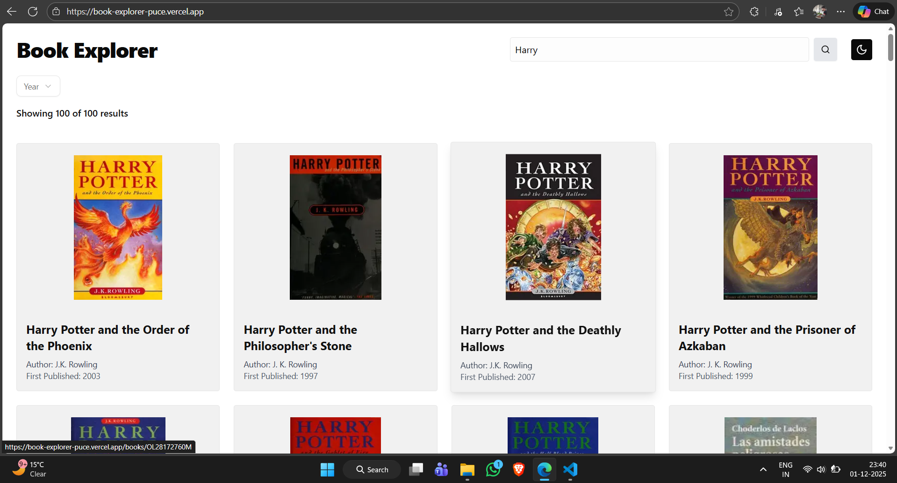
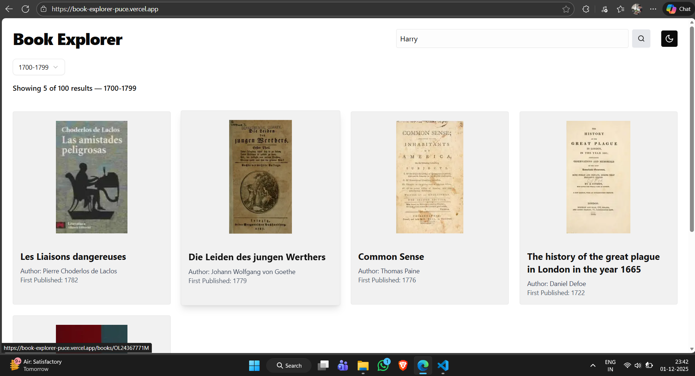
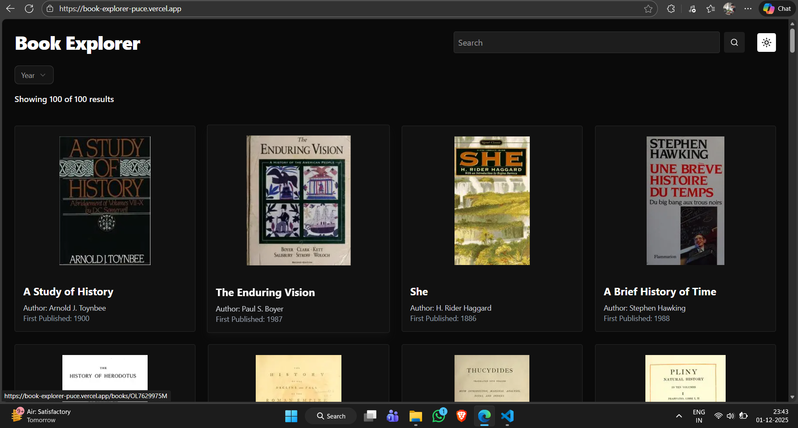

# Book Explorer - Discover and Explore Books Easily

A responsive and user-friendly web application to **search, filter, and explore books** from the Open Library API. Built with **Next.js**, **Tailwind CSS**, and **Next Themes** for dark/light mode. The app supports search by title, filtering by publication year, and pagination for smooth browsing.

---

### Live Demo - [Book Explorer](https://book-explorer-puce.vercel.app/)

---

## Tech Stack

| Frontend       | Styling        | State Management | API Integration | Theme |
| -------------- | -------------- | ---------------- | --------------- | ----- |
| Next.js        | Tailwind CSS   | React useState   | Open Library API| next-themes |
| React          | Custom CSS     | —                | —               | —     |

---

## Features

- 🔍 **Search Books** by title or keywords.
- 📅 **Filter Books** by publication year (with multiple year ranges).
- 📄 **Pagination** for efficient navigation through large datasets.
- 🌙 **Dark/Light Mode** toggle using **next-themes**.
- 📱 Fully responsive design for all devices.
- 📚 Displays book details like title, author, cover image, and year.
- ⚡ Optimized API calls and conditional rendering for better performance.

---

## Screenshots

- **Home Page**


- **Search Results**



- **Year Filter Applied**



- **Dark Mode View**



---

## Packages Used

`next`  
`react`  
`tailwindcss`  
`next-themes`  

---

## Installation & Setup

1. **Clone the repository**:

```bash
   git clone https://github.com/PrasadYeole-Developer/BookExplorer.git
   cd book-explorer
```
2. **Install dependencies**:

```bash
   npm install
```

3. **Run the development server**:

```bash
   npm run dev
```
4. **Open in browser**:

```bash
   http://localhost:3000
```
